# Flutter Components: Gap Analysis and Roadmap

## Where the library stands

About 30 public widgets share a consistent iOS-inspired design language: superellipse corners, backdrop blur, island-style toasts, and `0xff1c1c1e` sheets.

- **Strongest areas:** the modal system (`ComponentResponsiveModal` + `ComponentModalController`), the blurred and large-title app bars, and the `AlertSnackbar` toast stack.
- **Weakest areas:** form controls, loading and empty states, navigation for large screens, and theming hooks.

Current coverage:

- **Foundations:** `AppThemeData`, `AppDecoration`, `ContextExtension` (colors, type scale, breakpoints), `AppScreenSize`, `Logging`
- **Actions:** icon, light, danger, back, and close buttons; `ComponentGestureClick`
- **Inputs:** `ComponentTextField`, `ComponentFilterChip`, `ComponentDatePicker`
- **Display:** `ComponentCard`, `ComponentListTile`, `ComponentPill`, `ComponentCalendar`
- **Navigation:** `ComponentTabBar`, `ComponentBottomNavBar`, blurred, sliver, and large-title app bars
- **Overlays and feedback:** `ComponentResponsiveModal` (5 entry points), `ComponentDialogWidget`, `AlertSnackbar`, `ComponentBottomSheetHeader`, `SlideDownBar`
- **Layout and effects:** `ComponentResponsiveWidget`, `ComponentBlurredWidget`, `ComponentOnboardingCarousel`

## Fix first: issues found in existing code

- [lib/flutter_components.dart](lib/flutter_components.dart) never exports `component_icon_button.dart`, so `ComponentIconButton` can't be used by apps. The barrel file also re-exports itself on line 2.
- [lib/component_danger_button.dart](lib/component_danger_button.dart) declares `icon` and `isIconLeftAligned` but never renders them.
- [lib/component_text_field.dart](lib/component_text_field.dart) has three problems:
  - `showClearTextButton` is ignored, so the clear button always appears.
  - `_listener` calls `setState` on every keystroke, even when the clear button's visibility hasn't changed.
  - The hint uses the same style as the input text, so the two are visually identical.
- [lib/component_dialog_widget.dart](lib/component_dialog_widget.dart) puts a `Spacer` inside a `mainAxisSize: .min` column. Unless `height` is passed, the dialog stretches to full screen height. It also has no `show()` helper.
- [lib/utilities/app_theme_data.dart](lib/utilities/app_theme_data.dart): `darkTheme` sets `statusBarIconBrightness: Brightness.dark`, which puts dark icons on a black background.
- [lib/component_responsive_modal.dart](lib/component_responsive_modal.dart) has two problems:
  - About 150 lines of sheet and dialog scaffolding are copied across `show`, `showWithActions`, and `showWithActionsSimple`.
  - `showWithScaffold` hard-codes a 635px breakpoint instead of using `AppScreenSize.small` (600px).
- [lib/utilities/app_decoration.dart](lib/utilities/app_decoration.dart) declares its border radii as `static var`, so they are mutable and can't be used in `const` constructors. They should be `static const`.
- [lib/component_card.dart](lib/component_card.dart) always installs a click target (`onTap ?? () {}`), so cards that aren't tappable still show a pointer cursor.
- **Naming:** `SlideDownBar`, `OnboardingPage`, and `MyMaterialScrollBehavior` don't use the `Component` prefix.
- **Tests:** there is no root `test/` directory. The only tests are in `example/test`, and one of them is a leftover `tmp_` file.

## Missing components

### Tier 1: core building blocks most apps need

- **ComponentSwitch plus switch, checkbox, and chevron variants of `ComponentListTile`:** settings screens currently have no toggle.
- **ComponentListSection:** an iOS inset-grouped list, meaning one card with hairline dividers plus header and footer text. Today every tile renders as its own rounded card.
- **ComponentSegmentedControl:** driven by `value`/`onChanged`, with equal-width segments and a sliding thumb. `ComponentTabBar` needs a `TabController` and is scrollable and left-aligned, so it doesn't cover this case.
- **ComponentSkeleton (shimmer):** the `shimmerBaseColor`/`shimmerHighlightColor` tokens already exist but nothing uses them. Build it with one shared animation controller and wrap it in a `RepaintBoundary`.
- **ComponentEmptyState:** icon or illustration, title, message, and an optional action, plus an error variant with a retry button.
- **ComponentSearchField:** leading search icon, clear button, iOS-style Cancel, and optional debounce. `ComponentTextField` always requires an icon and draws a divider, so it doesn't fit this case.
- **Loading states:** add `isLoading` to the light, danger, and icon buttons, and add a `ComponentActivityIndicator`. The modal docs already reach for `CupertinoActivityIndicator`, so there's clear demand.
- **ComponentAdaptiveNavigation:** a sidebar or navigation rail on medium and larger screens that falls back to `ComponentBottomNavBar` on mobile. The library currently has no navigation for large screens.

### Tier 2: forms, overlays, and feedback

- **ComponentActionSheet:** a list of actions, including destructive ones, built on `ComponentResponsiveModal.show`.
- **ComponentSelectField and ComponentDateField:** fields styled like `ComponentTextField` that open a sheet or picker when tapped.
- **ComponentCheckbox and ComponentRadioGroup**
- **ComponentContextMenu:** opens on long-press on touch devices and on right-click on desktop.
- **ComponentPageIndicator:** dot indicator, then wire it into the onboarding carousel, which currently has none.
- **ComponentProgressBar and ComponentProgressRing**
- **ComponentBadge:** a count or dot for icons in the navigation bar and tabs.
- **ComponentAvatar:** falls back to initials when there's no image, and supports a stacked group.
- **ComponentOtpField:** PIN or verification code entry.
- **Date range picker and time picker:** `ComponentCalendar` already supports `highlightedRange`, so a range picker builds on existing work.

### Tier 3: nice to have

- **ComponentAccordion:** an expandable disclosure group.
- **ComponentStepper:** progress through a multi-step flow.
- **ComponentSlider**
- **ComponentQuantityStepper:** +/− buttons for a numeric value.
- **ComponentTooltip:** shown on hover on desktop.
- **ComponentRefreshControl:** a styled wrapper around pull-to-refresh.
- **ComponentNetworkImage:** placeholder and fade-in, without adding new dependencies.

## Foundation recommendation

Add a `ComponentThemeData` `ThemeExtension` (accent color, card and sheet colors, radii, hairline color) and register it from `AppThemeData`. Today components hard-code `context.isLightMode ? X : Y`, so an app can't change the branding without forking the library. New Tier 1 components should read from the extension from the start, and existing components can move to it gradually.

## How new components build on existing ones

```mermaid
flowchart LR
  ResponsiveModal[ComponentResponsiveModal] --> ActionSheet[ComponentActionSheet]
  ResponsiveModal --> SelectField[ComponentSelectField]
  ResponsiveModal --> DialogShow["ComponentDialogWidget.show"]
  DatePicker[ComponentDatePicker] --> DateField[ComponentDateField]
  TextField[ComponentTextField] --> SelectField
  SwitchWidget[ComponentSwitch] --> ListTile[ComponentListTile]
  ListTile --> ListSection[ComponentListSection]
  BottomNav[ComponentBottomNavBar] --> AdaptiveNav[ComponentAdaptiveNavigation]
  PageIndicator[ComponentPageIndicator] --> Onboarding[ComponentOnboardingCarousel]
```

## Conventions for every new component

- **File and naming:** put each component in `lib/component_<name>.dart`, use the `Component` prefix, and export it from the barrel file.
- **Styling:** use `RoundedSuperellipseBorder`, `AppDecoration` tokens, and colors from `context` (or `ComponentThemeData` once it exists).
- **Testability and accessibility:** put a `ValueKey<String>` on every tap target and provide a `semanticsLabel`.
- **Large screens:** don't shrink and center layouts. Adapt instead, for example a sheet becomes a dialog or popover, and bottom navigation becomes a rail or sidebar.
- **Performance:** use `const` constructors, wrap blur and animations in a `RepaintBoundary`, and never call `setState` every frame or every keystroke.
- **Demo and tests:** add an entry to [example/lib/gallery/gallery_catalog.dart](example/lib/gallery/gallery_catalog.dart) and a widget test under the root `test/` directory.
